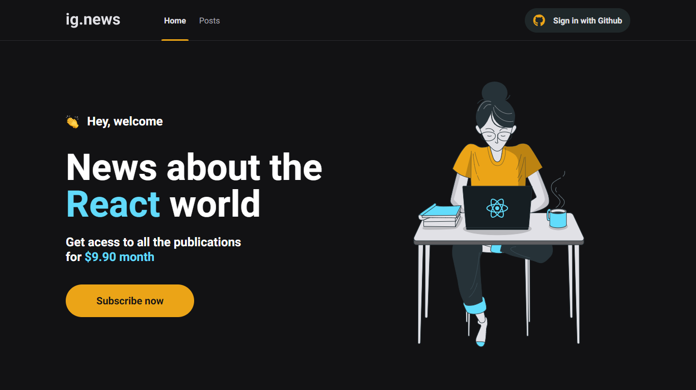
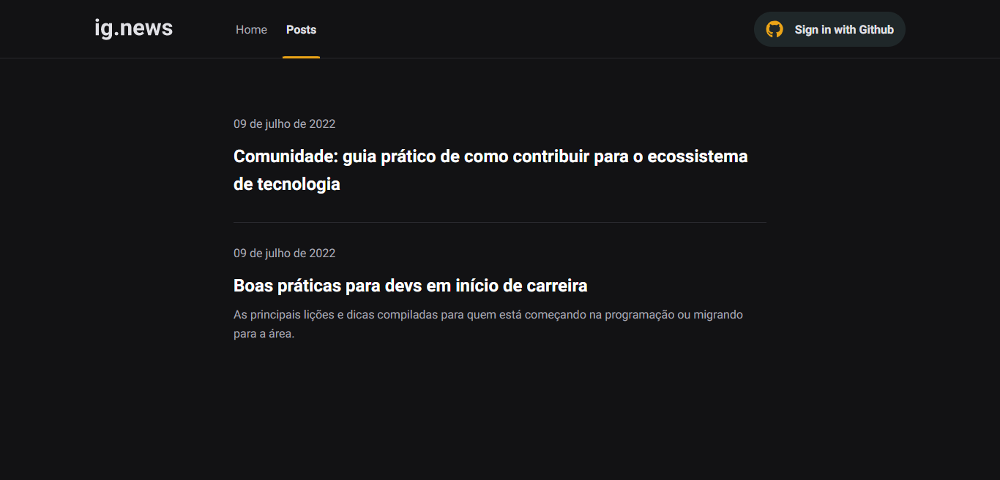
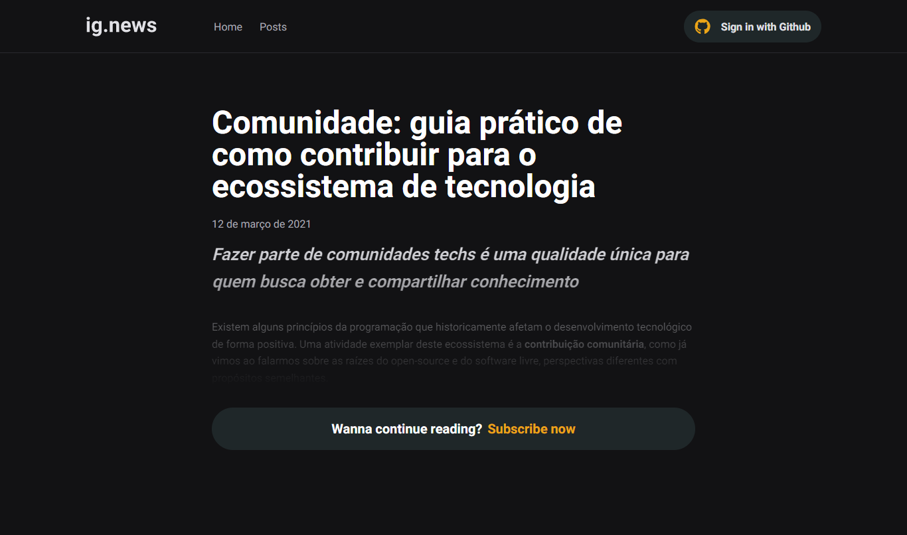
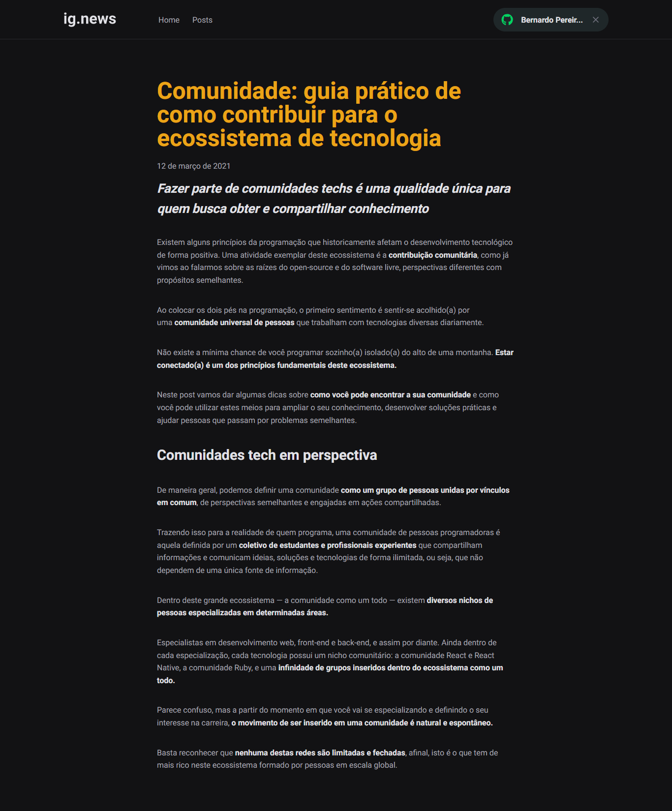

# ig.news

Esse desafio foi criado para treinar o que aprendeu até agora no ReactJS.

Essa será uma aplicação onde o seu principal objetivo é criar um blog de notícias sobre o mundo da biblioteca React. As postagens poderão ser visualizadas no formato resumido por qualquer pessoa, mas somente assinantes terão o prazer de ficar totalmente informados.

**OBS: Essa projeto foi construido por mim, na minha conta conta antiga do Github que perdi o acesso dela, por isso, resolvi trazer o projeto para a conta que tenho acesso para realizar modificações.**

Front-end | Projeto original: [BernardoOficial/Ig.news](https://github.com/BernardoOficial/ig.news)

## Tecnologias

- React + NextJS
- Typescript
- Stripe API
- Fauna DB
- Prismic CMS

## Estilização

- SCSS

## Autenticação social

- Next Auth (Github)

### Demo

https://ig-news-swart-eight.vercel.app/

### Home

### Postagens

### Ler postagem - não assinante

### Ler postagem - assinante

